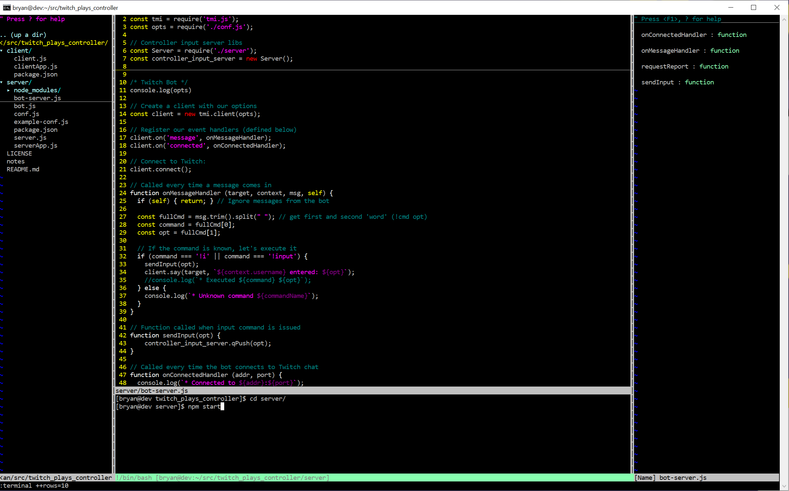

# Vim as an IDE



Configurations for Vim 8 to add common IDE features.

## Features

* File explorer via [NERDTree plugin](https://github.com/scrooloose/nerdtree)

* Quick class/function navigation via [Tagbar plugin](https://github.com/majutsushi/tagbar)

* Interactive shell window

## Installation

**Note**: This will overwrite your vim config files. Back them up first if you 
don't want to loose them.

```
cp -r vim/* ~/.vim
cp vimrc ~/.vimrc
```

## File Explorer

This window opens on the left side of the text editor.

Press F5 to toggle.

## Quick Navigation

This window opens on the right side of the text editor.

Press F8 to toggle.

## Interactive Shell

This window opens below the text editor.

Press F6 to open a new window.

Exit the shell as normal (`$ exit`, etc.)

## TODO

* Add plugin for linting

    * [syntastic](https://github.com/vim-syntastic/syntastic)

* Add pluging for refactoring

    * [vim-refactor](https://github.com/LucHermitte/vim-refactor)

* Add plugin for code completion

    * [YouCompleteMe](https://github.com/ycm-core/YouCompleteMe)
